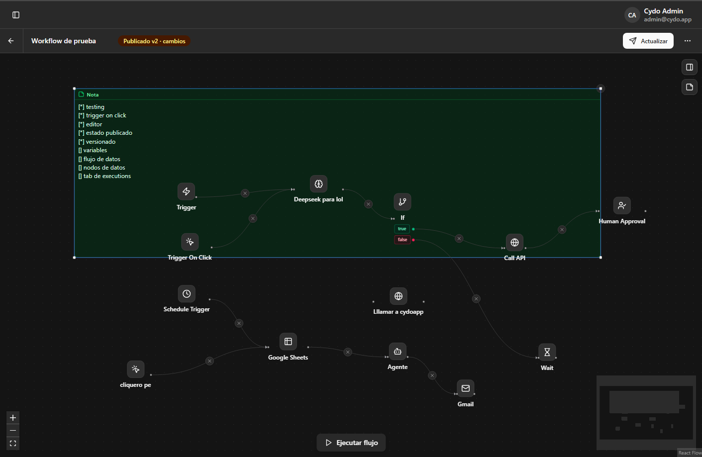

# cydowokflow (STILL IN DEVELOPMENT)

Aplicación basada en n8n, make, realizada con el objetivo de ser integrada en procesos Internos de las apps de Cydoflow.



## start:

1. ```pnpm install```

2. ```pnpm -r --parallel dev```
